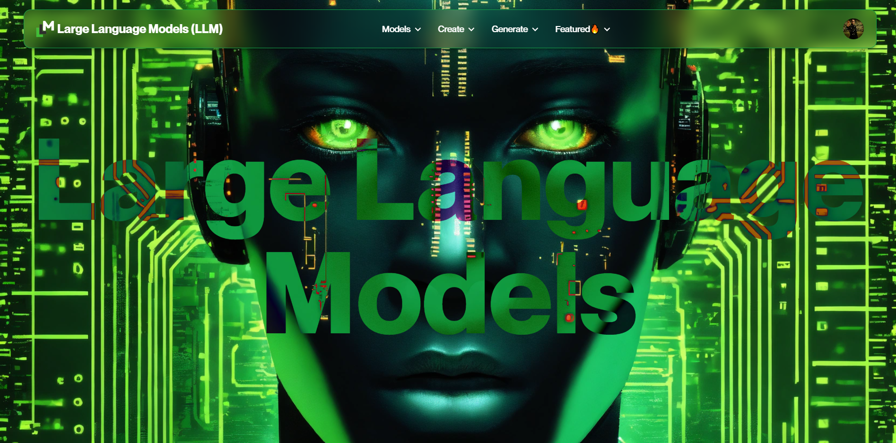

# Large Language Models(LLM)



## Description

- Built with React and Vite: [React](https://react.dev/), [Vite](https://vitejs.dev/)
- Utilizes Material-UI for UI components: [Material-UI](https://mui.com/)
- Tailwind CSS for styling: [Tailwind CSS](https://tailwindcss.com/)
- Implements form handling with React Hook Form: [React Hook Form](https://react-hook-form.com/)
- Zod validation: [Zod](https://zod.dev/)
- Image upload functionality with Dropzone: [React Dropzone](https://www.npmjs.com/package/react-dropzone)
- Utilizes Firebase for Backend as a Service: [Firebase](https://firebase.google.com/docs/guides)
- Utilizes Radix UI navigation menu for hoverable navigation: [Radix UI](https://www.radix-ui.com/)
- Integrates Google Generative AI library for the Gemini model: [Google Generative AI](https://ai.google.dev/tutorials/get_started_node)

## Features

- **Create Custom Models:** Build AI models tailored to specific requirements using an intuitive interface.
- **Explore Pre-built Models:** Discover the latest advancements in AI technology and explore new use cases through a curated collection of models.
- **Effortless Content Generation:** Utilize powerful models like GPT-3.5 Turbo, DALL-E, and Gemini to generate text, images, and more with ease.
- **Comprehensive Model Library:** Access a diverse array of Large Language Models (LLMs), each designed to excel in specific domains, from language translation to creative artistry.
- **Dedicated Models Page:** Delve deeper into each model's features, capabilities, and potential use cases through detailed documentation and examples.

## Application Overview

[LLM Whimsical Application overview ](https://whimsical.com/llm-models-C32pdRJzyTKjRJWf3q4Wnc)

## Dependencies

```
- "@emotion/react": "^11.11.4"
- "@emotion/styled": "^11.11.0"
- "@google/generative-ai": "^0.3.1"
- "@hookform/resolvers": "^3.3.4"
- "@mui/icons-material": "^5.15.14"
- "@mui/material": "^5.15.14"
- "@radix-ui/react-navigation-menu": "^1.1.4"
- "@tinymce/tinymce-react": "^4.3.2"
- "dayjs": "^1.11.10"
- "dompurify": "^3.0.11"
- "firebase": "^10.9.0"
- "react": "^18.2.0"
- "react-dom": "^18.2.0"
- "react-dropzone": "^14.2.3"
- "react-hook-form": "^7.51.1"
- "react-router-dom": "^6.22.3"
- "zod": "^3.22.4"
```

## Optimization

Optimization is achieved through caching on global state, utilizing the same state to provide data to components efficiently. This approach enhances performance and ensures seamless data flow throughout the application avoiding unnecessary api calls.
